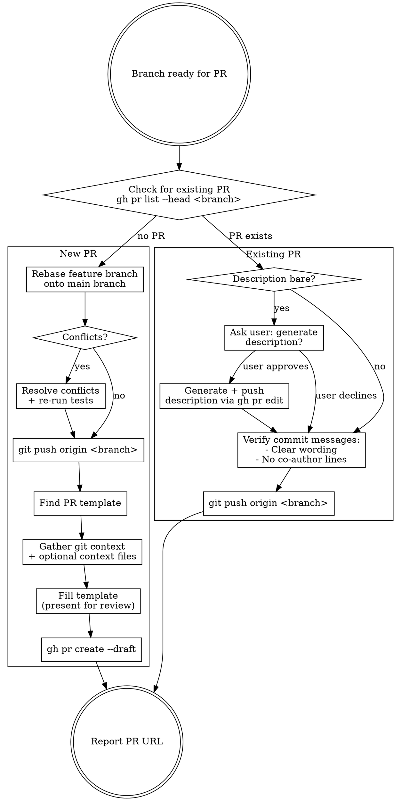

# Submit PR

Handles the full workflow for getting a feature branch into a PR — either creating a new draft PR or pushing updates to an existing one. Includes PR description generation from git changes, PR template, and optional context documents.

## Usage

```
/submit-pr [context-file-paths...]
```

Examples:
- `/submit-pr` - Submit with description generated from changes only
- `/submit-pr docs/plans/feature-design.md` - Include design doc as context for description
- `/submit-pr research.md plan.md` - Multiple context files

## When to Use

- Branch work is complete and ready for PR
- User says "create PR", "submit PR", "push to PR", "open PR"
- User wants to write or fill out a PR description
- Existing PR needs new commits pushed

## Workflow



## New PR Flow

### 1. Rebase Feature Branch

```bash
git checkout <feature-branch>
git rebase <main-branch>
```

- **If conflicts:** resolve them, then re-run the project's test suite before continuing
- **Do NOT force push** unless the branch was already pushed and rebase rewrote history. For a never-pushed branch, a regular `git push` works.

### 2. Push Branch

```bash
git push origin <feature-branch>
```

Only use `--force-with-lease` if the branch was previously pushed and rebase rewrote its history.

### 3. Generate PR Description

#### 3a. Find PR Template

Search these locations in order:
```
.github/PULL_REQUEST_TEMPLATE.md
.github/pull_request_template.md
.github/PULL_REQUEST_TEMPLATE/default.md
docs/pull_request_template.md
PULL_REQUEST_TEMPLATE.md
```

**If not found:** Use AskUserQuestion to request the template.

#### 3b. Gather Git Context

```bash
# Changes on this branch vs main
git diff origin/$(git symbolic-ref refs/remotes/origin/HEAD | sed 's@^refs/remotes/origin/@@')...HEAD

# Commit messages
git log origin/$(git symbolic-ref refs/remotes/origin/HEAD | sed 's@^refs/remotes/origin/@@')..HEAD --oneline

# Branch name (often has ticket number)
git branch --show-current
```

#### 3c. Read Context Files (if provided)

Only read files explicitly passed as arguments. Do NOT auto-discover or search for context files.

#### 3d. Fill Template

| Section | Rules |
|---------|-------|
| **Ticket** | Extract from branch name or commits, format as link |
| **Summary** | 2-4 bullets, 150-200 words max. Lead with what/why. Include reviewer hot topics. |
| **Open Questions** | Include only if questions exist. Otherwise DELETE section entirely. |
| **Testing** | How work was tested. Be specific. |
| **Performance** | Include only if performance-relevant. Otherwise DELETE section entirely. |
| **Everything below** | DO NOT TOUCH. Leave exactly as-is in template (merge checklists, "Carefully Review", etc.) |

**DO NOT** check or uncheck any checklist items — those are for reviewers.

##### Hot Topics for Summary

When these patterns appear in changes, call them out for reviewers:
- External API calls (latency, error handling)
- Database/schema changes (migration concerns)
- Auth/permission changes (security)
- Concurrency (goroutines, locks, channels)
- Caching (invalidation strategy)
- Config changes (deployment coordination)

##### Length Limits (Strict)

**Total editable content: Under one page (~400 words)**

| Section | Max |
|---------|-----|
| Summary | 200 words |
| Testing | 100 words |
| Open Questions | 50 words (if included) |
| Performance | 100 words (if included) |

#### 3e. Present for Review

Present the filled template for user review. Do NOT create the PR automatically.

### 4. Create Draft PR

On user approval, create as draft. User will manually mark ready.

```bash
gh pr create --draft \
  --title "<TICKET-ID>: <title>" \
  --body "$(cat <<'EOF'
<generated description>
EOF
)"
```

- **Title prefix:** Extract ticket ID from the Jira URL or branch name

## Existing PR Flow

### 1. Check Description

Fetch the current PR body:
```bash
gh pr view --json body --jq '.body'
```

If the body is empty, only contains the unfilled PR template, or is clearly placeholder text (e.g. just a ticket link with no summary), use AskUserQuestion to ask whether the user wants to generate a proper description. If yes, follow steps 3a–3d from the New PR Flow, then push via `gh pr edit` (see "Updating an Existing PR Description" below).

### 2. Check Commits

Review new commit messages since last push:
- Clear, descriptive wording
- No `Co-Authored-By` trailers

### 3. Push

```bash
git push origin <feature-branch>
```

## Updating an Existing PR Description

When the user wants to update a PR description (not create a new PR):

1. Follow steps 3a–3d above to generate the description
2. Present for review
3. On approval, push via `gh pr edit`:
   - If a PR URL was provided, extract the PR number from it
   - Otherwise target the current branch's PR
   - Use a HEREDOC: `gh pr edit <number> --body "$(cat <<'EOF' ... EOF)"`

## Common Mistakes

| Mistake | Fix |
|---------|-----|
| Creating PR as non-draft | Always use `--draft` |
| Force-pushing a never-pushed branch | Regular `git push` for new branches |
| Forgetting to rebase before new PR | Always rebase for new PRs |
| Skipping tests after conflict resolution | Conflicts can break code silently |
| Auto-discovering context files | ONLY use files explicitly provided as arguments |
| Exceeding length limits | Keep total editable content under ~400 words |
